## BUG-001 — Completed matches remain available for betting

**Severity:** Critical

**Reproduction Steps:**

1. Open the application with a valid user ID.
2. Review the match list.
3. Identify a match whose kickoff time has already passed.
4. Select an outcome for the completed match.
5. Enter a valid stake.
6. Place the bet.

**Expected Result:**

Only upcoming/pre-match events should be available for betting. Completed matches should not be available for selection or should be rejected by the backend.

**Actual Result:**

Completed matches are displayed in the match list, remain selectable, and a bet can be successfully placed on them.

**Business Impact:**

Users can place bets on events that have already concluded, directly violating a core business rule and potentially resulting in invalid financial transactions. If these transactions are deemed valid, users could place bets on already-completed matches and receive payouts for them.

**Evidence:**

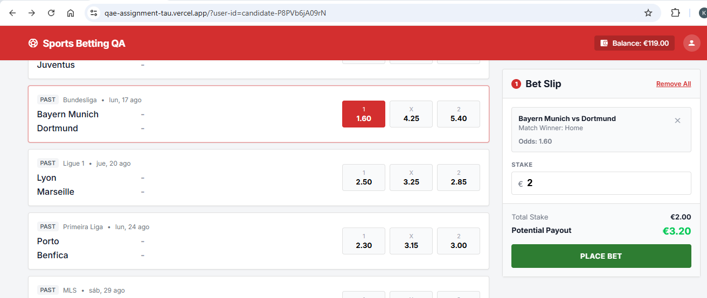

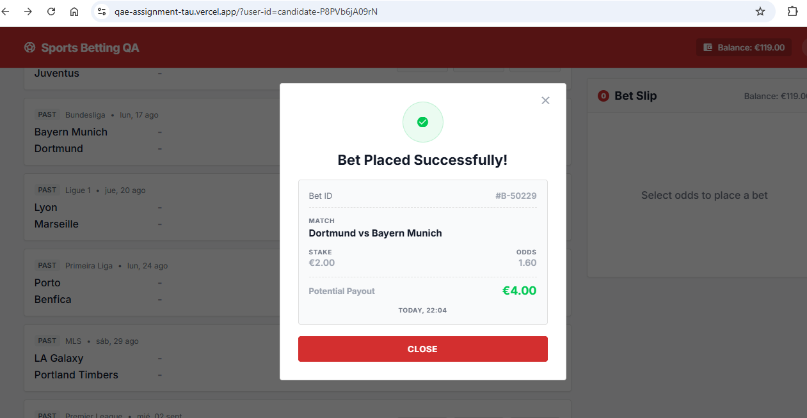

A match whose kickoff time had already passed was displayed in the match list, and a bet on that match was successfully placed.

---

## BUG-002 — Balance is not updated after bet placement, allowing unlimited bets

**Severity:** Critical

**Reproduction Steps:**

1. Open the application with a valid user ID.
2. Select an upcoming match and a valid outcome.
3. Enter a valid stake.
4. Place the bet successfully.
5. Observe the balance displayed in the application.
6. Place another valid bet without refreshing the page.
7. Repeat the process multiple times.

**Expected Result:**

After a successful bet, the user's available balance should be immediately updated by deducting the stake. Subsequent bets should be validated against the updated balance.

**Actual Result:**

The displayed balance is not updated after placing a bet. The user can continue placing bets using the original balance until the page is manually refreshed.

**Business Impact:**

Users can place multiple bets beyond their actual available balance, potentially causing significant financial inconsistencies.

**Evidence:**

Multiple bets can be successfully placed without refreshing the page while the displayed balance remains unchanged.

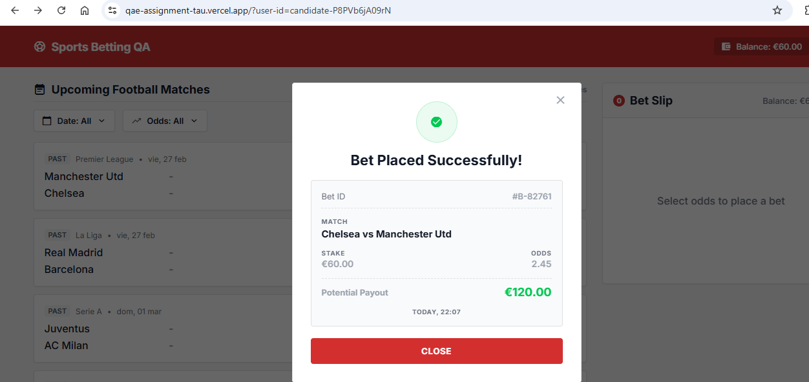

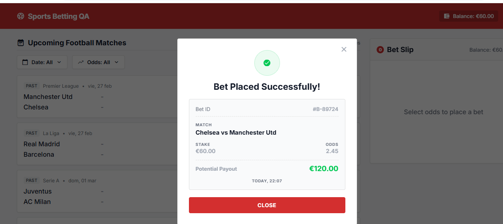

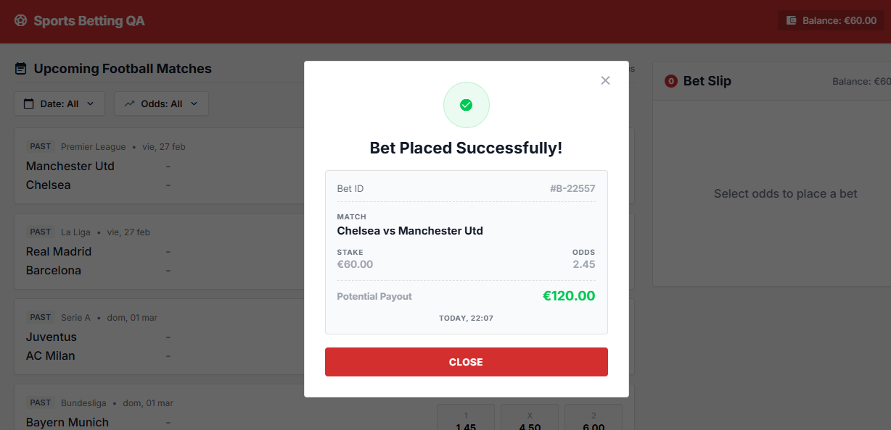

---
## BUG-003 — Multiple bets can be placed by rapidly clicking Place Bet

**Severity:** Critical

**Reproduction Steps:**

1. Open the application with a valid user ID.
2. Select an upcoming match and a valid outcome.
3. Enter a valid stake.
4. Rapidly click the **Place Bet** button multiple times.
5. Observe the resulting bet placements and balance.

**Expected Result:**

Once bet placement is initiated, the **Place Bet** button should prevent additional submissions until the current request is completed, ensuring that only one bet is placed.

**Actual Result:**

Rapidly clicking **Place Bet** allows the same bet to be submitted multiple times, resulting in multiple successful bets.

**Business Impact:**

A single user action can result in multiple financial transactions, potentially causing unintended balance deductions and duplicate bets.

**Evidence:**

Rapidly Triggering **Place Bet** resulted in multiple successful bet placements for the same selection/stake.

**Note:** Evidence for the first three test scenarios was captured during an execution in which a total of **9 bets were placed**. The screenshots provided show **3 of the 9 bets** as representative evidence of the test execution.

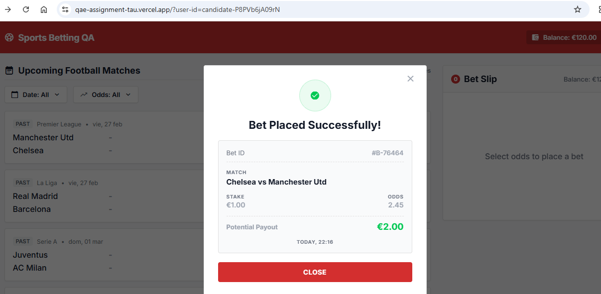

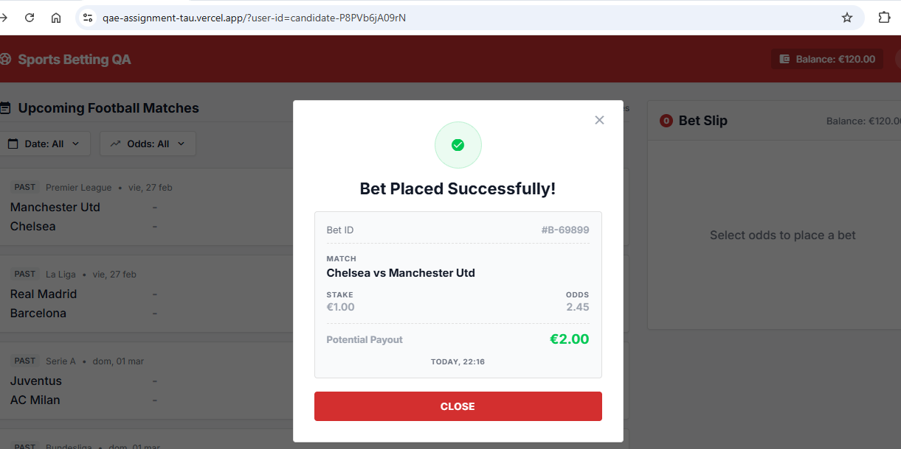

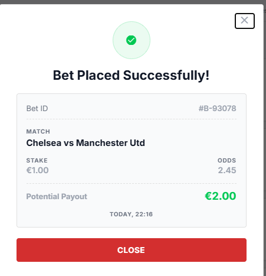

---

## BUG-004 — Potential payout in receipt is calculated using a fixed multiplier instead of the selected odds

**Severity:** High

**Reproduction Steps:**

1. Open the application with a valid user ID.
2. Select an upcoming match.
3. Select an outcome with odds different from `2.00`.
4. Enter a valid stake.
5. Place the bet successfully.
6. Review the potential payout in the success receipt.

**Expected Result:**

The potential payout displayed in the receipt should be calculated as:

`Stake × Odds at placement`

For example, a €10.00 stake with odds of 2.50 should result in a €25.00 potential payout.

**Actual Result:**

The receipt always displays the potential payout as:

`Stake × 2`

regardless of the selected odds.

**Business Impact:**

Users are shown incorrect financial information in the bet receipt, potentially causing them to misunderstand the return associated with their bet.

**Evidence:**

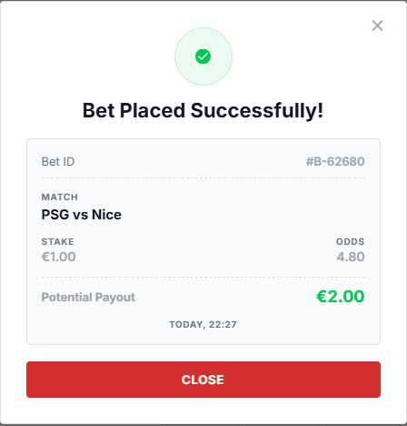

The selected odds differed from `2.00`, but the receipt displayed a potential payout equal to exactly twice the stake.

---
## BUG-005 — Match kickoff time is not displayed

**Severity:** Medium

**Reproduction Steps:**

1. Open the application with a valid user ID.
2. Review the match list.
3. Check the information displayed for the available matches.

**Expected Result:**

Each match should display its kickoff date/time label, allowing the user to identify when the match starts.

**Actual Result:**

The match list does not display the kickoff time for the matches.

**Business Impact:**

Users cannot clearly determine the start time of a match, reducing the information available when deciding whether to place a bet and making it harder to identify whether an event is upcoming.

**Evidence:**

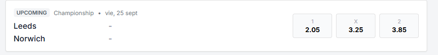

Match cards display the teams and odds, but no kickoff time is shown.

---
## BUG-006 — Receipt does not display selection and matchup is reversed

**Severity:** Medium

**Reproduction Steps:**

1. Open the application with a valid user ID.
2. Select an available match and place a bet.
3. Open the bet receipt.

4. Review the match and selection information displayed in the receipt.

**Expected Result:**

The receipt should display the selected betting option and the matchup in the same home/away order as shown when placing the bet.

**Actual Result:**

The selected betting option is not displayed in the receipt, and the matchup is displayed with the teams in the opposite order.
Note: The odds are display correctly

**Business Impact:**

Users cannot clearly verify which selection they placed the bet on. The reversed matchup can also cause confusion when identifying the teams involved and validating the bet details.

**Evidence:**

The receipt does not show the selected betting option and displays the matchup with the teams reversed.
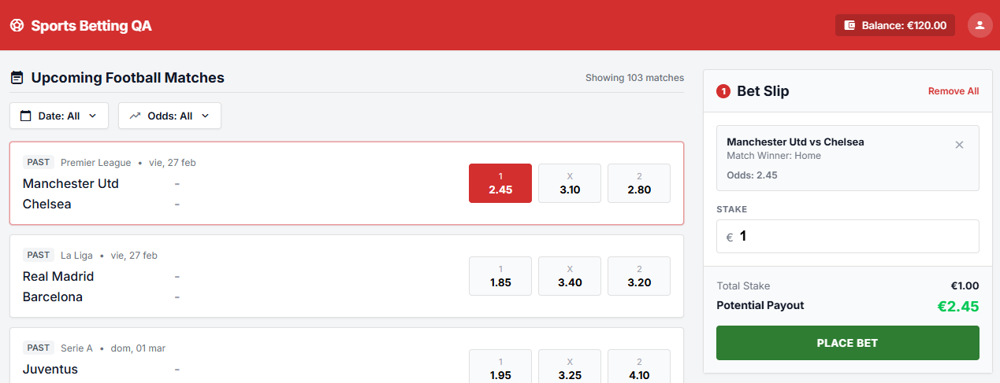
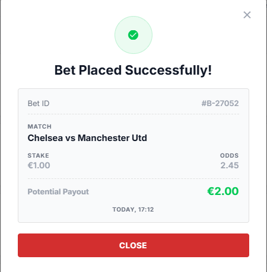

---
## BUG-007 — Place Bet API allows bets exceeding available balance

**Severity:** Critical

**Reproduction Steps:**

1. Obtain the user's current balance using a valid user ID.

2. Validate the available balance.

3. Build a valid `Place Bet` request body using valid match and betting selection data, with a stake amount greater than the user's available balance.

4. Send the `Place Bet` request.

5. Observe the API response and verify whether the bet is created.

**Expected Result:**

The `Place Bet` API should validate the user's available balance before processing the bet. If the stake exceeds the available balance, the request should be rejected and the bet should not be created.

**Actual Result:**

The `Place Bet` API accepts the request and creates the bet even though the stake is greater than the user's available balance.

**Business Impact:**

Users can place bets exceeding their available funds, potentially resulting in invalid financial transactions and significant financial inconsistencies.

**Evidence:**

A `Place Bet` request with a stake greater than the user's available balance is successfully processed, and the bet is created despite insufficient funds.

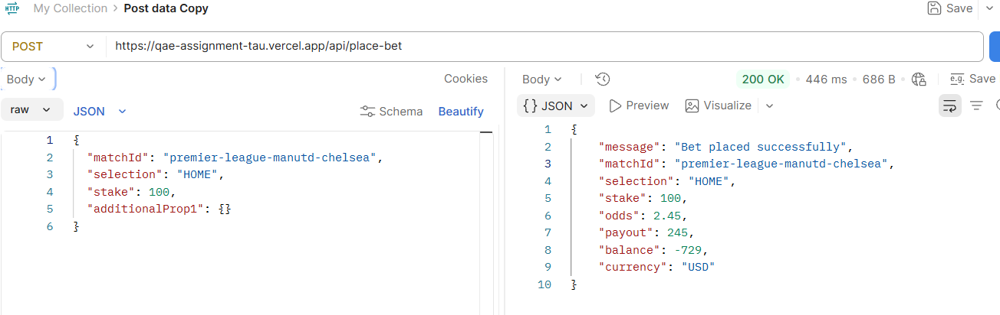